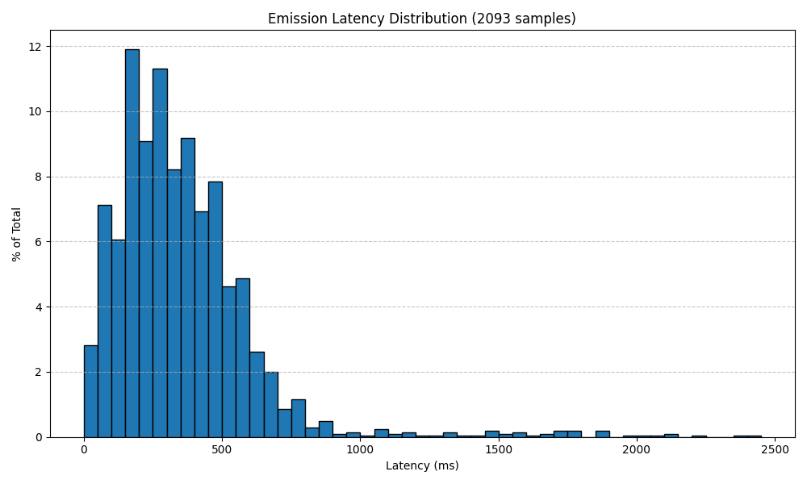

# Emission Latency Benchmark — Findings

**Model:** `universal-streaming-english`
**Endpoint:** `wss://streaming.assemblyai.com/v3/ws`
**Dataset:** 100 LibriSpeech test-clean files (human-labeled word timestamps)
**Chunk size:** 100ms | **Sample rate:** 16kHz

---

## Results

| Metric | Value |
|--------|------:|
| **Median** | 305 ms |
| **Mean** | 357 ms |
| **P90** | 600 ms |
| **P99** | 1,683 ms |
| **Std Dev** | 269 ms |
| **WER** | 2.48% |
| **Session Init** | 84 ms |
| **Word Samples** | 2,093 |

## Distribution

The distribution peaks at 150–250ms with a long right tail. The vast majority of words (>90%) are returned within 600ms of the audio being sent.

## Key Takeaways

- **Median emission latency of 305ms** is consistent with AssemblyAI's internal benchmarks of 300–350ms.
- **WER of 2.48%** indicates strong transcription accuracy on clean read speech.
- **Session initialization adds ~84ms** of fixed overhead per connection.
- These results were measured from a consumer internet connection (not co-located with AssemblyAI infrastructure), so production latency from co-located servers should be equal or better.

## Methodology

See the [project README](../../README.md) for full details on how emission latency is computed.
